# 📰 Новостная лента (News App)

Полнофункциональное приложение для управления новостями с возможностью создания, редактирования и удаления постов.

## ✨ Особенности

✅ **CRUD операции** - Создание, чтение, обновление, изменение, удаление постов  
✅ **REST API** - Полноценный API с GET, POST, PUT, DELETE  
✅ **Фильтрация** - Фильтрация новостей по категориям  
✅ **Модульная структура** - Разделение на routes, controllers, services  
✅ **Custom Middleware** - Логирование всех запросов  
✅ **Статические файлы** - Раздача HTML, CSS, JS через express.static()  
✅ **Полная валидация** - Проверка данных на сервере и клиенте  

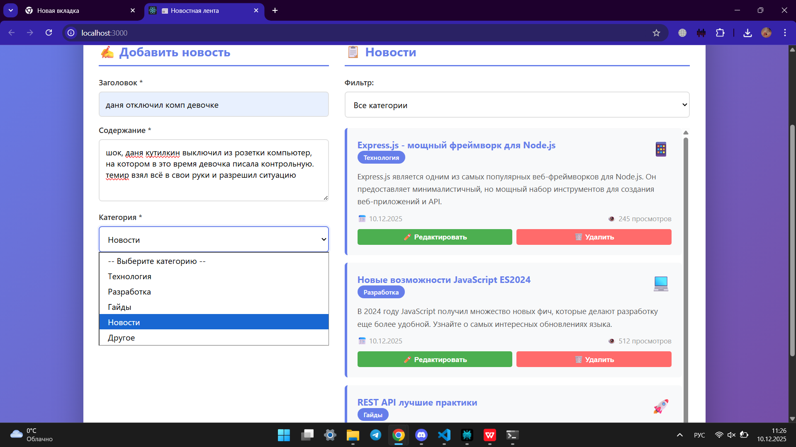
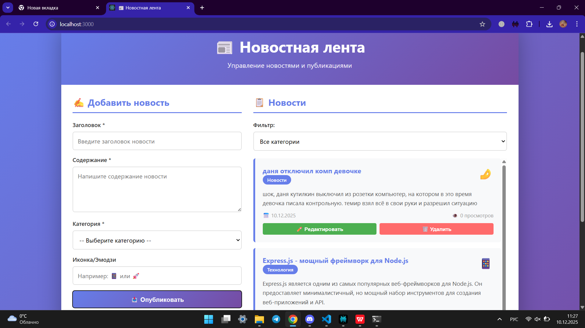
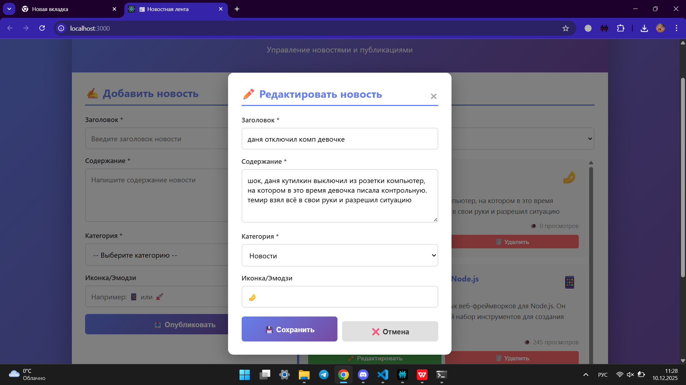
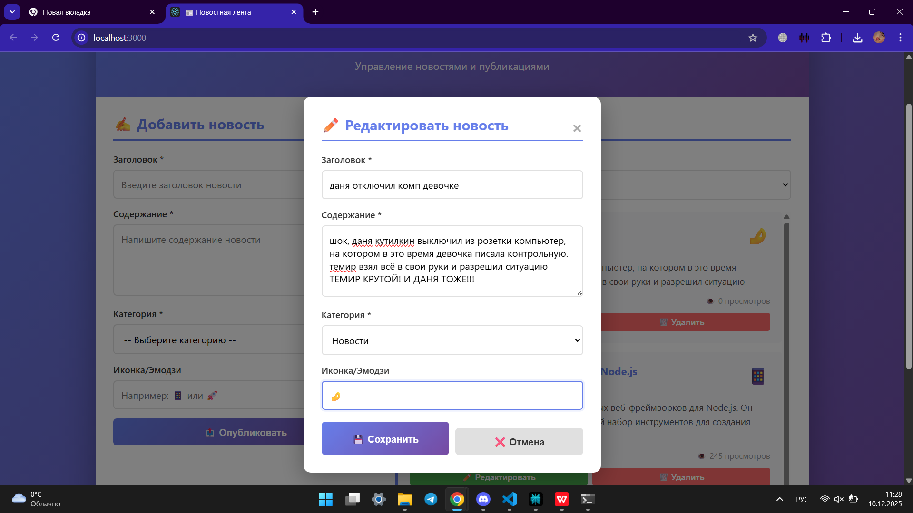
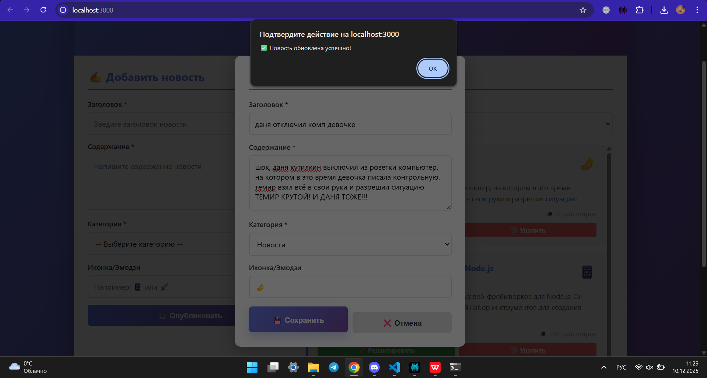
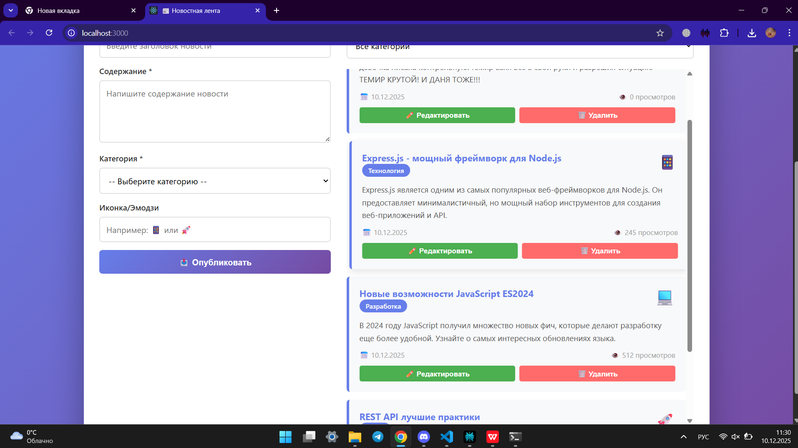
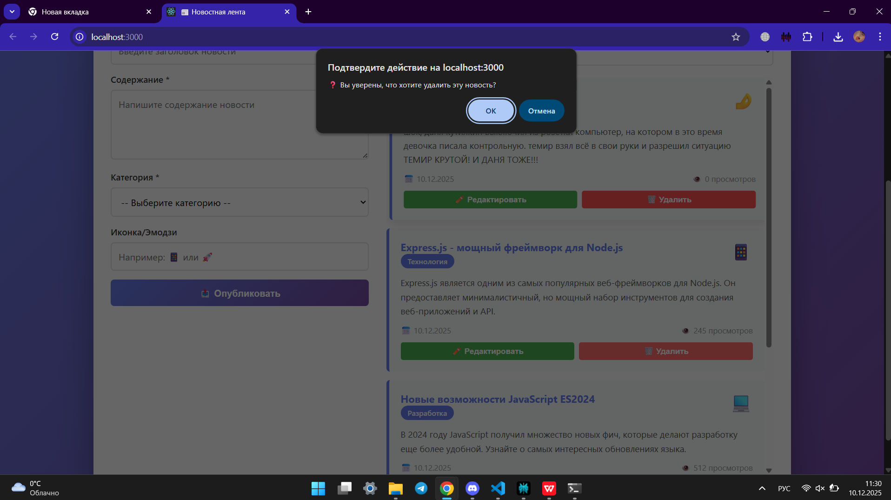

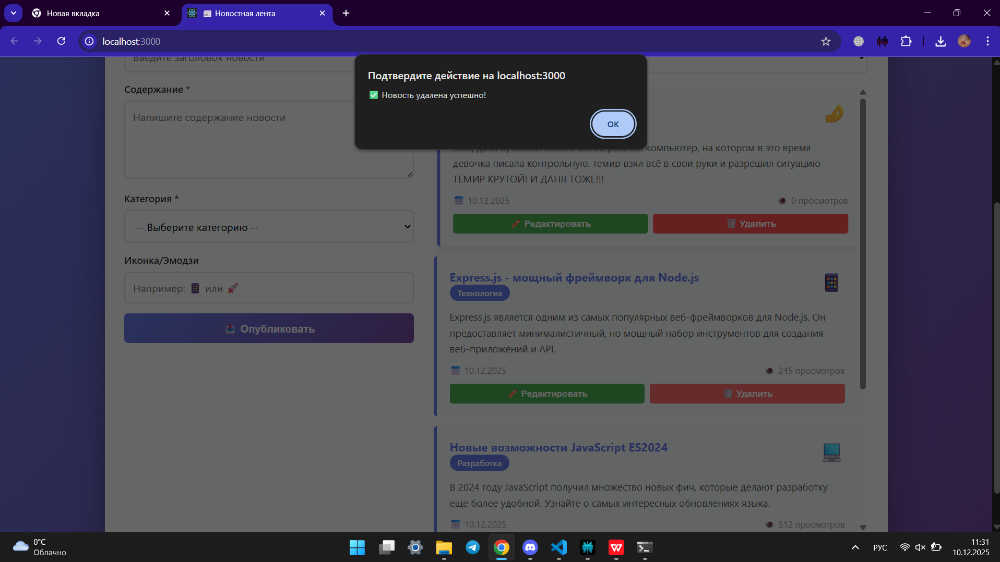
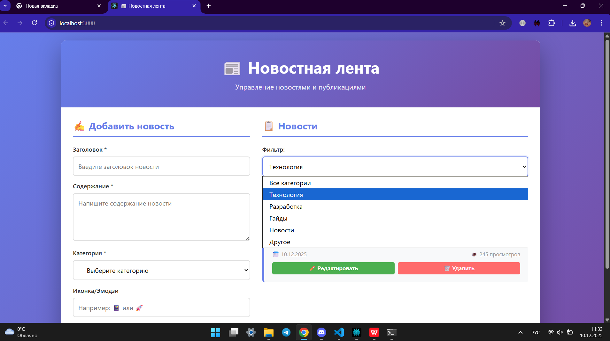
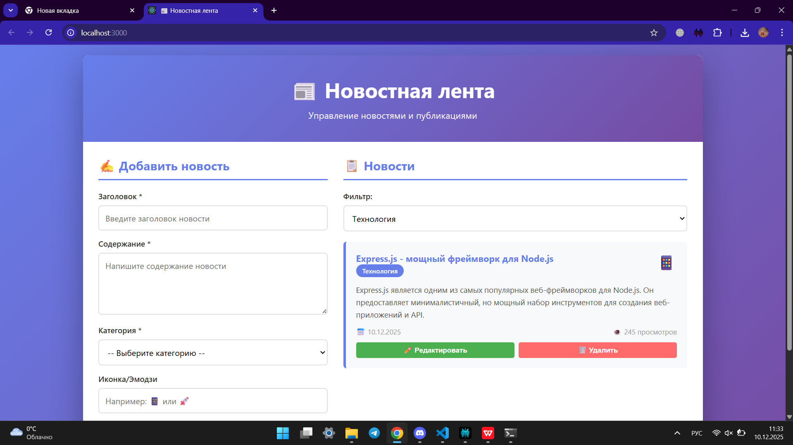
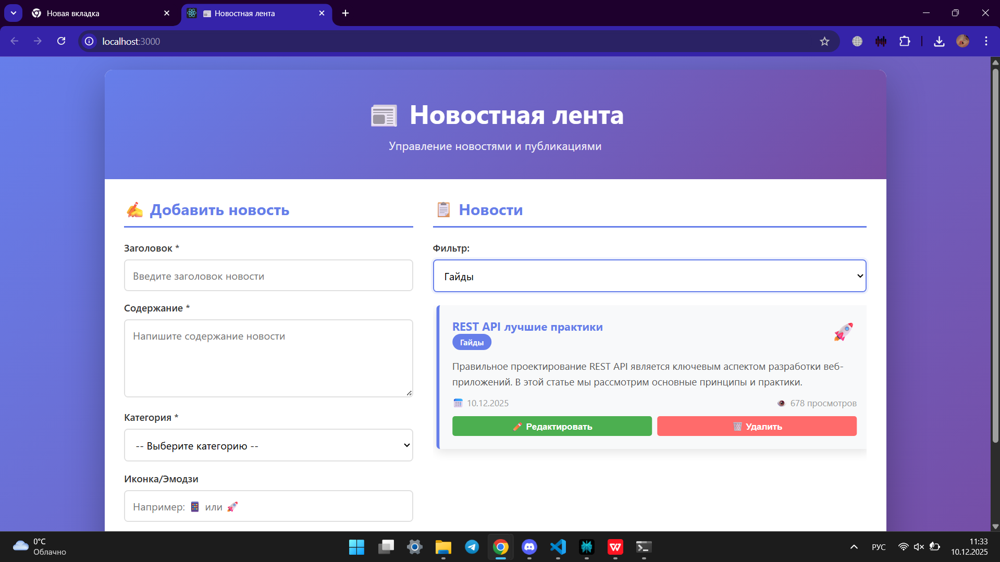